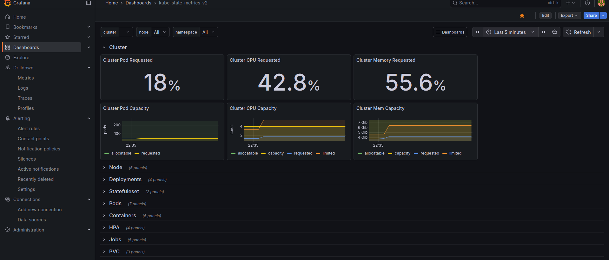

## Monitroing Stack



- node-exporter
- kube-state-metrics
- prometheus
- grafana


### Install

Deploy Monitoring Stack
```bash
oc apply -k services/monitoring
```

Get URL from Prometheus
```bash
echo "https://$(oc get route prometheus -n observability -o jsonpath='{.spec.host}')"
```


Get URL from Grafana
```bash
echo "https://$(oc get route grafana -n observability -o jsonpath='{.spec.host}')"
```

---
#### Grafana Dasboards
- Node Exporter
https://grafana.com/grafana/dashboards/1860-node-exporter-full/

- Kube State Metrics
https://grafana.com/grafana/dashboards/13332-kube-state-metrics-v2/

- Trivy
https://grafana.com/grafana/dashboards/16337-trivy-operator-vulnerabilities/
